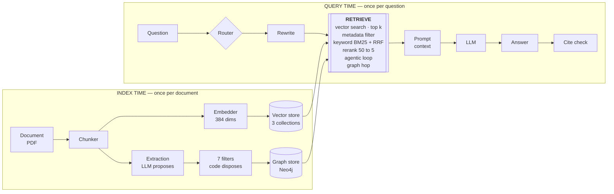

# The RAG Ladder

**One document. One question. Twelve pipeline stages, each adding exactly one thing — and every
answer changing in front of you.**

The same content as [rag-ladder.html](rag-ladder.html), in a form you can read, search, paste into
notes, or hand out afterwards. The deck is for the room; this is for before and after it.

| | |
|---|---|
| **Audience** | Engineers who have heard of RAG and want to see where it breaks |
| **Length** | One hour, 55 slides, plus a live demo if there is time |
| **Deck** | [`rag-ladder.html`](rag-ladder.html) — `start presentation/rag-ladder.html`, then <kbd>f</kbd> |
| **Running the demo** | [DEMODAY.md](../DEMODAY.md) |
| **Setting it up** | [OPERATIONS.md](../OPERATIONS.md) |

Every number in this document came off a real run: a four-core CPU box, no GPU, `qwen2.5:3b` for
chat, `all-minilm` for embeddings, Qdrant and Neo4j in Docker. **Including the two results that
undercut the tidy story.**

---

## Contents

[The problem with RAG talks](#the-problem-with-rag-talks) ·
[What RAG actually is](#what-rag-actually-is) ·
[The corpus](#the-corpus-a-document-engineered-to-be-hostile) ·
[The architecture](#the-architecture) ·
[The twelve rungs](#the-twelve-rungs) ·
[Propose / dispose](#an-llm-proposes-deterministic-code-disposes) ·
[The sequels that vanished](#the-sequels-that-vanished) ·
[Honest results](#the-ladder-is-not-a-straight-line) ·
[Flow isolation](#flow-isolation-and-the-cost-of-honesty) ·
[Takeaways](#five-things-worth-keeping)

---

## The problem with RAG talks

Everyone can draw the diagram. Almost nobody can show you where it breaks.

| The usual talk | This talk |
|---|---|
| A box diagram: chunk, embed, retrieve, generate | The same question at every rung, so you see the delta rather than the destination |
| A demo where the answer is right | A corpus engineered so specific rungs **must** fail |
| A list of techniques, all presented as improvements | Real measurements, including **two rungs that did not help** |
| No indication which ones actually earned their place | Everything on screen is clickable down to the evidence span |

---

## What RAG actually is

A language model knows what was in its training data. It does not know your document.
**Retrieval-Augmented Generation** is the unglamorous fix: find the relevant text first, put it in
the prompt, and instruct the model to answer only from it.

1. **Index, once.** Split the document into pieces small enough to be specific and large enough to
   be meaningful. Turn each into a vector. Store it.
2. **Retrieve, per question.** Turn the question into a vector in the same space. Find the nearest
   chunks. This is a similarity search, not an understanding step.
3. **Generate, grounded.** Put those chunks in the prompt. Constrain the model to them. Make it
   refuse when they are insufficient.

**Every one of the twelve rungs is a modification to one of those three steps.** That is the whole
map. Nothing that follows is a different architecture — only a better-instrumented version of this
one.

---

## The corpus: a document engineered to be hostile

Real film titles as familiar labels. **Every person, studio, location and figure invented.**

**Why counterfactual, and why it must stay that way.** The model already knows the real credits. If
the corpus matched reality, a correct answer would prove nothing — the model could bypass retrieval
entirely and every rung would look equally good. Because every credit is invented, a right answer is
*only* possible by reading the document.

Twelve traps, each disarmed at a known rung:

| Trap | What it is | Fixed at |
|---|---|---|
| 1 | A filmography split across a page break | 2 |
| 2 | Superseded casting — three performers, one role | 3 |
| 3 | A ten-digit figure embeddings will blur | 4 |
| 4 | The credit that matters, buried last in a long crew block | 5 |
| 5 | A colloquial query against press-kit phrasing | 6 |
| 6 | An orphan pronoun: no name, no title | 7 |
| 7 | A two-title comparison needing two lookups | 9 |
| 8 | A collaborator recurring across three films | 10 |
| 9 | A count spread across the whole document | 10 |
| 10 | A connection no single chunk contains | 10 |
| 12 | One name spanning two node types | entity resolution |

Trap 11 needs two films sharing a title in different years, which the Spider-Man subset has no
instance of. Trap 12 is the only one **not** fixed by a rung — entity resolution handles it, so its
row in the evaluation heatmap stays flat across the whole ladder. That flat row is itself the point
worth showing.

---

## The architecture

Two lanes. Index time runs once per document; query time runs once per question.



### Which component arrives at which rung

| Rung | What appears | Where |
|---|---|---|
| 0 | Question, LLM, Answer — nothing else | query |
| 1 | Chunker, Embedder, Vector store, Prompt, `vector search · top k` | both |
| 2 | *(the chunker changes: fixed → recursive)* | index |
| 3 | `metadata filter` chip | retrieve |
| 4 | `keyword BM25 + RRF` chip | retrieve |
| 5 | `rerank 50 to 5` chip | retrieve |
| 6 | Rewrite | query |
| 7 | *(the chunker changes: recursive → contextual)* | index |
| 8 | Cite check | query |
| 9 | `agentic loop` chip | retrieve |
| 10 | Extraction, 7 filters, Graph store, `graph hop` chip | both |
| 11 | Router | query |

Rungs 2 and 7 add no box — they change what the chunker *does*. That is worth saying out loud,
because it is the clearest example of a rung that is a decision rather than a component.

---

## The twelve rungs

Rung *n* keeps everything rung *n−1* turned on. The answer cache key covers the document, the
question and **every resolved flag**, so no two rungs can ever share a completion.

---

### Rung 0 — No RAG
*The hallucination baseline*

**What it adds:** Nothing. The question goes straight to the model.

**How it works**

- No document is loaded, no retrieval runs, and the prompt carries **no context at all**.
- This is the only rung allowed to answer unconstrained. Every other rung is bound to retrieved text
  and must otherwise say `Not found in the provided documents.`
- The response is flagged `unconstrained` in the API and in the UI, because an answer with no
  provenance should never be mistaken for one that has it.

**What changed** — asked *"Who plays Peter Parker?"*

> In the Marvel Cinematic Universe, Peter Parker is played by **Tom Holland**… Prior to this,
> **Andrew Garfield** portrayed Peter Parker before being replaced by **Tobey Maguire**.

> [!WARNING]
> **Two failures, not one.** None of those names appear in our document — and the sentence is also
> wrong about the real world, since Maguire came *before* Garfield. Fluent, confident, and
> unfalsifiable unless you already knew the answer. That is the baseline every rung above is
> measured against.

---

### Rung 1 — Naive RAG
*The core loop*

**What it adds:** Chunk → embed → store → retrieve → ground the prompt.

**How it works**

- **Chunker.** The document is split into fixed 400-token windows with **zero overlap**, page by
  page, ignoring structure entirely.
- **Embedder.** Each chunk becomes a 384-dimension vector via `all-MiniLM-L6-v2`. The question is
  embedded with the same model — that shared space is the whole trick.
- **Retrieve.** Cosine similarity, top 5 chunks.
- **Ground.** Those five chunks go into the prompt with an instruction to answer only from them, or
  refuse.

**What changed**

> **Niraj Ranasinghe** as Peter Parker in Spider-Man: No Way Home (2021).

> [!NOTE]
> **This is the largest single jump in the whole talk.** Tom Holland is gone. Every name now comes
> from the document. Everything in the next ten rungs is refinement on top of this — worth saying
> plainly, because it is tempting to imply each rung is equally transformative.

---

### Rung 2 — Chunking
*Overlap and boundaries*

**What it adds:** A structure-aware splitter with overlap, replacing the blind one.

**How it works**

- Split on **section**, then paragraph, then sentence — never mid-fact if it can be helped.
- 400 tokens with **80 tokens of overlap** carried between consecutive chunks, so a fact spanning a
  boundary survives in at least one of them.
- The old fixed strategy is kept, not deleted. All three chunkings live side by side in separate
  collections, so any rung can be compared against any other on identical text.
- Chunk ids stay stable: `{docId}#{seq}`, one global sequence across all three strategies. That id
  later becomes the only join between the vector store and the graph.

**What changed** — trap 1, a filmography split across a page break

| Rung | Answer to *"how many features?"* |
|---|---|
| 1 | **3** — Homecoming, Infinity War, No Way Home |
| 2 | **5** — sees the whole list |

> [!WARNING]
> **The corpus says six.** Retrieval at rung 2 is correct — the section comes back whole, all six
> credits present — and the 3B model then miscounts them. That is a generation limit, not a
> retrieval failure. The rung transition is real; the arithmetic is not. Say so before someone in
> the third row does.

---

### Rung 3 — Metadata filter
*Right title, right year*

**What it adds:** Structured filters applied before the vector search runs.

**How it works**

- Every section carries front matter: `docType`, `subject`, `year`, `studio`, `market`. It is parsed
  at index time and stored on the chunk payload.
- Those fields get real payload indexes in the vector store — keyword indexes for the strings,
  integer for the year.
- The filter is **inferred from the question** when the caller does not supply one, and the
  inference is reported back so you can see what was applied.
- Crucially this is a **pre-filter**, not a post-filter: it shrinks the candidate set before
  similarity is computed, so a 2002 record cannot crowd out a 2021 one on style alone.

**What changed** — trap 2, superseded casting

| Rung | Answer |
|---|---|
| 2 | Both current and historical performers, plus the full recast history |
| 3 | The current performer. **History dropped.** |

> [!NOTE]
> **Same facts, better prioritised.** Nothing was retrieved that rung 2 could not reach; the
> difference is that `year` is now a filter rather than a word in a sentence. Most real-world RAG
> wins look like this — unglamorous plumbing beating cleverness.

---

### Rung 4 — Hybrid search
*Embeddings can't do exact figures*

**What it adds:** A lexical BM25 arm, fused with the vector arm.

**How it works**

- Embeddings are terrible at exact strings. `3,571,150,070` is not a concept — it is a token, and a
  normalising encoder throws away precisely what makes it useful.
- The keyword arm retrieves through a full-text index and is then **BM25-scored locally**.
- Results merge by **Reciprocal Rank Fusion**, k=60. Fusion is computed in the application rather
  than in the vector store, so every hit keeps a label: `vector`, `keyword`, or `both`.
- Those labels are the teaching payload. *"Found by keyword only"* is the most persuasive line in
  the demo, and native fusion discards it.

**What changed**

```
question   what was the domestic opening weekend?

vector     production notes, extended shoot in Kandy
keyword    Domestic opening weekend 3,571,150,070
both       box office record, No Way Home

RRF k=60  ->  the keyword-only hit ranks first
```

> [!NOTE]
> **Retrieval is not one thing.** Two arms with different failure modes, combined by rank rather
> than by score — RRF needs no score normalisation between arms, which is exactly why it survives
> contact with production.

---

### Rung 5 — Reranking
*Retrieve wide, rank precise*

**What it adds:** A second, more expensive scoring pass over a wider candidate set.

**How it works**

- Retrieve **50 candidates** instead of 5, then rescore all of them and keep the best 5.
- The reranker judges query and passage **together**, which a bi-encoder cannot: the embedding of a
  chunk is computed before anyone asks a question, so it must be a compromise across all possible
  questions.
- The UI shows rank-before and rank-after with the delta, so you can watch a chunk climb from
  position 34 into the answer.
- This is the talk's honest cost slide: one model call per candidate.

**What changed** — cost, measured cold

| | |
|---|---|
| Candidates rescored per question | **50 → 5** |
| Slowest rung in the deck, cold | **219 s** |

> [!WARNING]
> **Accuracy you buy with latency.** On a GPU this is milliseconds; on a CPU it dominates. Worth
> naming, because "add a reranker" is advice given far more often than the bill for it is mentioned.

---

### Rung 6 — Query rewrite
*Users don't write like press kits*

**What it adds:** An LLM pass that rewrites the question before searching.

**How it works**

- The question is expanded into the vocabulary the corpus actually uses, plus an explicit keyword
  list for the lexical arm.
- The original and the rewrite are both shown — a rewrite that drifts is a failure you need to be
  able to see.
- It costs one extra model call per question, before retrieval even starts.

**What changed** — *"Who did the **music** for Homecoming?"*, where the corpus says *"original score
composed by"*

| Rung | Answer |
|---|---|
| 5 | **Correct.** Piyal Devendra composed the original score. |
| 6 | **Correct.** Identical answer. |

> [!WARNING]
> **The trap did not fire.** This rung was supposed to be the one that fixed the colloquial-query
> problem, and the embedder already placed "music" near "score" without help. I am leaving it in the
> talk rather than quietly swapping the example: a trap designed on paper may not survive a
> competent encoder, and knowing *which* of your layers is not earning its keep is the entire point
> of building a ladder.

---

### Rung 7 — Contextual chunks
*Orphan chunks lack referents*

**What it adds:** A generated context prefix on every chunk before embedding.

**How it works**

- A chunk reading *"He wore the suit for the closing act"* is unretrievable and unusable — no name,
  no title, no year.
- Each chunk is prefixed with what work it belongs to, its year and its document type, and **then**
  embedded. The prefix is part of the indexed text, not decoration.
- This is a third full collection, so it can be compared against the other two on identical source
  text.

**What changed**

From this rung on, the main demo question tilts toward a different continuity: the prefixes make the
earliest films' chunks read as more strongly on-topic, and the answer changes *emphasis* rather than
correctness.

> [!WARNING]
> **The ladder stops being monotonic here.** Rungs 7 to 11 change which true answer surfaces first,
> not whether the answer is true. Three different performers really did hold the role. Presenting
> rung 11 as "the best" would be a story the data does not support.

---

### Rung 8 — Citations
*Trust and verification*

**What it adds:** Sentence-level attribution, checked rather than claimed.

**How it works**

- Each factual sentence in the answer is attributed to a chunk, and then **verified** against that
  chunk — a citation that does not support its sentence is marked unverified.
- A **groundedness** score reports the share of factual sentences carrying a citation the cited
  chunk visibly supports.
- Note what this rung is not: it adds *no* retrieval power. The answer does not get better. It gets
  **auditable**.

**What changed**

```
#  chunk              page  verified  supporting span
1  doc_de5a#35           6   yes       "…Niraj Ranasinghe assuming the part."
2  doc_de5a#19           2   no        —

groundedness  50%
```

> [!NOTE]
> **The only rung that improves the reader rather than the retrieval.** In most production systems
> this is the layer that decides whether anyone is allowed to use the thing.

---

### Rung 9 — Agentic
*Multi-part needs multi-search*

**What it adds:** An iterative retrieve → assess → re-query loop.

**How it works**

- *"Which of these two opened bigger, and by how much?"* is two lookups and an arithmetic step. One
  similarity search cannot express it.
- The model decides what to search for next based on what came back, and the full **trace** is
  recorded: iteration, action, query, hits, and the stated reason.
- The trace is the honest part. An agent whose reasoning you cannot inspect is an agent you cannot
  debug.

**What changed** — cost, measured

| | |
|---|---|
| Cold, several model calls per question | **401 s** |
| The same question, cached | **16 ms** |

> [!WARNING]
> **Unbounded loops are unbounded bills.** Iterations are capped and every one is visible. This rung
> buys real capability on compound questions and is straightforwardly wasteful on simple ones —
> which is what rung 11 exists to notice.

---

### Rung 10 — Graph
*Relations, paths, counts*

**What it adds:** An entire second index — an LLM-extracted knowledge graph.

**How it works**

- **Extraction.** The model proposes triples per chunk against a closed ontology — 14 node types,
  26 relation types.
- **Then code disposes.** Seven deterministic filters, of which evidence grounding is the hard one:
  the quoted span must be a literal substring of its chunk after whitespace and typographic
  normalisation.
- **Entity resolution.** Type barriers are absolute and enforced by key construction, not a
  similarity threshold. Person, Character, Film and Studio can never merge.
- **Three query modes.** `expand` seeds from vector search and walks outward; `path` runs
  shortestPath and builds the answer from the traversal; `aggregate` skips vectors entirely and
  counts in Cypher.
- **The join is one field.** Graph chunk nodes carry no embedding — their id matches the vector
  payload's `chunkId`. That string is the entire vector-to-graph integration.

**What changed** — the funnel, measured on 26 chunks

```
extracted    267
grounded     267
conformant   267
committed    235      32 dropped by resolution and dedup
```

126 entities — 56 Person, 45 Character, 13 Film, 7 Location, 3 Studio, 2 Franchise. Plus 292
`COLLABORATED_WITH` edges derived after commit and marked `derived: true`.

> [!NOTE]
> **An LLM proposes, deterministic code disposes.** Structural edges are written by code; only
> semantic edges come from the model, and none of them reach the graph without surviving all seven
> filters. Reverse that relationship and the graph becomes a confident fiction.

---

### Rung 11 — Router
*Not every query needs every layer*

**What it adds:** A classifier that chooses which layers to run — and which to skip.

**How it works**

- The question is classified, and the classification selects a route: lookup, relational, path,
  aggregation, or multi-part.
- It turns things **off** as readily as on. A path question does not need reranking, hybrid
  retrieval or an agentic loop, and running them costs latency for nothing.
- The classification, the chosen route and every applied flag are reported, so a bad routing
  decision is visible rather than mysterious.
- This is the rung that makes the previous ten affordable.

**What changed** — *"How is Isuru Obeysekera connected to Nethmi Tomei?"*

| Rung | Answer |
|---|---|
| 9 | `Not found in the provided documents.` |
| 10 | `Not found in the provided documents.` |
| 11 | **Isuru Obeysekera composed for Spider-Man (2002), which starred Rashmi Samaraweera, who acted in Spider-Man: Far From Home (2019), which starred Nethmi Tomei.** |

Applied flags: `classified: path` · `graphMode=path` · ~~`agentic`~~ · ~~`rerank`~~ · ~~`hybrid`~~

> [!NOTE]
> **The two names never appear in the same chunk.** No amount of retrieval finds that link, and
> rungs 9 and 10 correctly *refuse* rather than inventing something. Rung 10's graph mode is always
> `expand`; only the router selects `path`. Four hops, and the answer is constructed from the
> traversal rather than generated from retrieved text.

---

## An LLM proposes, deterministic code disposes

The seven filters, in order:

1. **Evidence grounding.** The quoted span must be a literal substring of its chunk. Highest-leverage
   check in the system.
2. **Ontology conformance.** Outside the closed vocabulary, dropped — never coerced into the nearest
   legal predicate.
3. **Direction and type.** An inverted edge is a correctable mistake: flip it and count the
   correction.
4. **Dangling endpoints.** A relation whose subject or object was never declared as an entity is
   discarded.
5. **Confidence floor.**
6. **Entity resolution.** Seven rules, type barriers first.
7. **Deduplication.** Repeats become one edge carrying a mention count — repeated assertion is a
   real reliability signal.

**Why grounding is the load-bearing one.** A fabricated relation rarely arrives with a real
supporting span. Requiring the evidence to be quotable from the source text removes most hallucinated
triples without any model in the loop.

**And a measured argument for the whole design:**

| Extraction model | Edges committed |
|---|---|
| Local 3B, about an hour | **8** |
| A capable model, about a minute | **235** |

Identical filters both times. The filters did not get weaker — the input got better. A capable model
quotes evidence verbatim, so **267 of 267** triples cleared the grounding check.

---

## The sequels that vanished

**The symptom.** The graph held **11** films from a corpus with 13 title records. *Spider-Man 2*,
*Spider-Man 3* and *The Amazing Spider-Man 2* had no node at all — and their cast and crew had been
quietly re-attributed to the first film in each series.

**The cause.** The year barrier only ran when two titles were **identical**. Different titles fell
through to fuzzy matching — and `"Spider-Man"` vs `"Spider-Man 2"` scores about **0.97**
Jaro-Winkler with near-identical embeddings.

**The fix.**

```csharp
case "Film":
    // year is a barrier, not a tie-breaker
    if (leftYear != rightYear) return false;
    if (sameName) return true;
    // a numeral carries the whole meaning
    if (ordinal(l) != ordinal(r)) return false;
    return SimilarityMerge(...);
```

> [!NOTE]
> **11 films became 13, and every one got its own cast and director.** Two regression tests now pin
> it. The lesson generalises past this codebase: **fuzzy matching cannot see the one character that
> carries the meaning.** Put the hard barriers before the soft ones.

---

## The ladder is not a straight line

One question, twelve rungs, cold cache, four CPU cores. This is the table I would have preferred not
to have.

| Rung | *Who plays Peter Parker?* | Cold |
|---|---|---|
| 0 | **Tom Holland** — not in the document | 23 s |
| 1 | Ranasinghe | 89 s |
| 2 | Ranasinghe + history | 42 s |
| 3 | Ranasinghe, history dropped | 7 s |
| 4–6 | unchanged | 36–266 s |
| 7–9 | **Pathirana leads** | 74–401 s |
| 10 | All three films, by title and year | 283 s |
| 11 | as rung 8 | 38 s |

> [!WARNING]
> **Do not promise that every rung is better.** The jump from 0 to 1 is enormous — hallucination to
> grounding. Everything after it changes *emphasis*. From rung 7 the contextual prefixes tilt the
> answer toward a different continuity, because three performers really did hold the role and each
> rung weighs the evidence differently.

**What the ladder is actually for.** Not proving that more layers are better. Showing you *which*
layer fixed a specific failure, so you can stop adding the ones that fix nothing on your data. Two
of these eleven earned nothing on this corpus — and that is the most useful finding in the talk.

---

## Flow isolation, and the cost of honesty

Rules that make the comparison mean something:

- The answer cache key covers the document, the question and **every resolved flag**. Two rungs can
  never share a completion.
- No rung reuses another rung's retrieval.
- **No conversation history.** Every question is independent, so rung 7 cannot quietly benefit from
  what rung 6 established.
- Rungs 1–11 answer only from retrieved context, or say exactly `Not found in the provided documents.`
- Four **ungrounded control questions** about films absent from the corpus. Every rung 1–11 must
  refuse them; rung 0 must not. That group is the honesty check for the entire demo.

And the practical consequence:

```
cold   rung 9   401 s
cached rung 9    16 ms

answers cached  19 / 50   persisted
```

Twelve rungs of one question on a CPU box is twenty minutes of model calls. Whole answers are cached
to disk, bounded to the fifty most recently used, and survive a restart — because a demo you cannot
re-run is a demo you cannot trust.

---

## Five things worth keeping

1. **Grounding is the whole game; the rest is tuning.** Rung 0 to rung 1 is the difference between an
   answer and a guess. Nothing above it comes close to that delta.
2. **Instrument every layer, or you are guessing.** Per-arm labels, rank deltas, evidence spans,
   funnels. Two of our eleven layers turned out to earn nothing on this corpus — we only know because
   we could see inside.
3. **Let an LLM propose; never let it decide.** Extraction gets seven deterministic filters and a
   review gate. Evidence must be quotable from the source. Reverse that and your graph becomes a
   confident fiction.
4. **Hard barriers before soft ones.** Type and year are rules. Similarity is a hint. Run the rules
   first — or a 0.97 string match silently eats three films.
5. **Build the failures on purpose.** A corpus where the model cannot cheat, and questions it must
   refuse. A demo that only shows successes has told you nothing about your pipeline.

---

## Numbers, if someone asks

| | |
|---|---|
| Corpus | 26 sections, one franchise, four continuities, ten of twelve traps |
| Chunks | 14 fixed · 26 recursive · 26 contextual |
| Ontology | 14 node types, 26 relation types, closed |
| Extraction funnel | 267 extracted → 267 grounded → 267 conformant → **235 committed** |
| Graph | 126 entities · 235 semantic edges · 292 derived |
| The connection question | 4 hops, and no chunk contains it |
| Conversation history | 0, by design |
| Tests | 86, one skipped without Neo4j credentials |
| Answer cache | 50 most recently used, persisted, survives a restart |

Everything on the screen during this talk is reachable by clicking something in the app — retrieved
chunks, per-arm scores, rank deltas, extracted triples, evidence spans, traversal paths, timings,
and the exact prompt that was sent.
